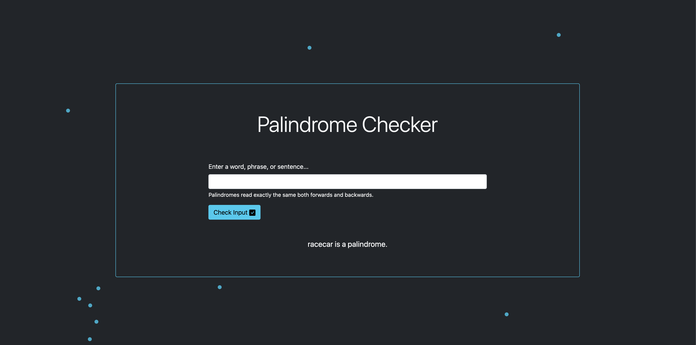
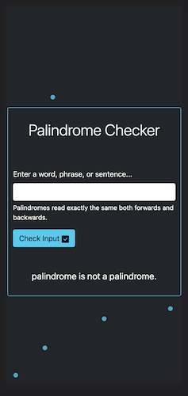
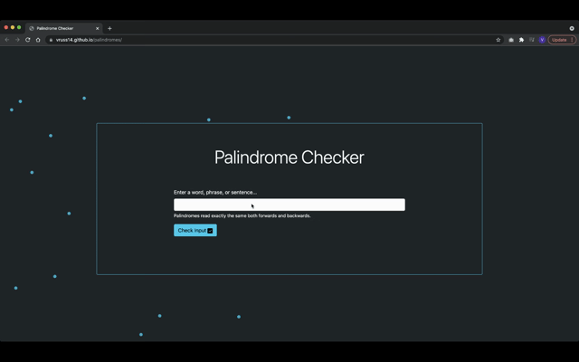

# Palindrome Checker

## Overview

A palindrome checker built with JavaScript that tests whether or not a given string is a palindrome.

## Description

This project incorporates several built-in JavaScript methods and features a simple UI with an animated background. The logic behind the palindrome checker was fairly straightforward for me to create, since I recognized that I would need to clean up the given string and then check and see if the string forwards perfectly matched the same string backwards.

Creating the animated background was a really exciting challenge for me as a developer, and it was something unlike anything that I've built before. I began by finding a tutorial that discussed creating a bouncing ball animation in pure CSS: https://www.the-art-of-web.com/css/bouncing-ball-animation/. This wasn't exactly the effect I hoped to create, but it was an excellent starting point. After I got one ball successfully bouncing in a div on the screen, I then worked on getting the ball to bounce all over the screen (and behind the form so that the UI wouldn't be too distracting). I then focused on getting multiple balls on the page to bounce, and I wanted these to appear as though they bounce randomly.

I researched about SASS mixins for animations, since if I could treat the animation itself as a function (and pass in different values for each ball) I could achieve a "random" effect. I found this article, which helped me understand how to translate this concept to SASS: https://stackoverflow.com/questions/40183991/create-a-sass-mixin-for-animation. With a combination of SASS mixins and SASS for loops, I was able to generate a different animation for each ball in the background of the page. The last thing I wanted to do was start the CSS animations mid-way (so that on page load all the balls don't start bouncing from the bottom left corner of the screen). I found a neat CSS trick here: https://css-tricks.com/starting-css-animations-mid-way/ which discussed how using negative animation delay values could help.

I also wanted to take the opportunity to write some tests using Jest for this project. I had to do a bit of extra configuration so that I could export the palindrome function and check its accuracy. All tests are currently passing. Overall, this project was a delight to create and I'm excited to use what I've learned in building future projects.

Please find the deployed page here: https://vruss14.github.io/palindromes

## Technologies Used

- HTML
- CSS
- Bootstrap
- SASS
- JavaScript
- Jest

## Installation

No installation steps are required to view this project. To view the page, visit the URL above. The application's source code can be found on GitHub here: https://github.com/vruss14/palindromes.

## Usage

This page is a palindrome checker, which checks an input string and outputs on the screen whether or not the string qualifies as a palindrome. The webpage includes responsive design and can be viewed successfully on all devices.

Below is a screenshot of the desktop version of the deployed page:

Below is a screenshot of the deployed page on mobile:

Below is a GIF of the page in action:

## Credits

Valerie Russell was the sole contributor to this project. Contact her at vruss14@gmail.com.